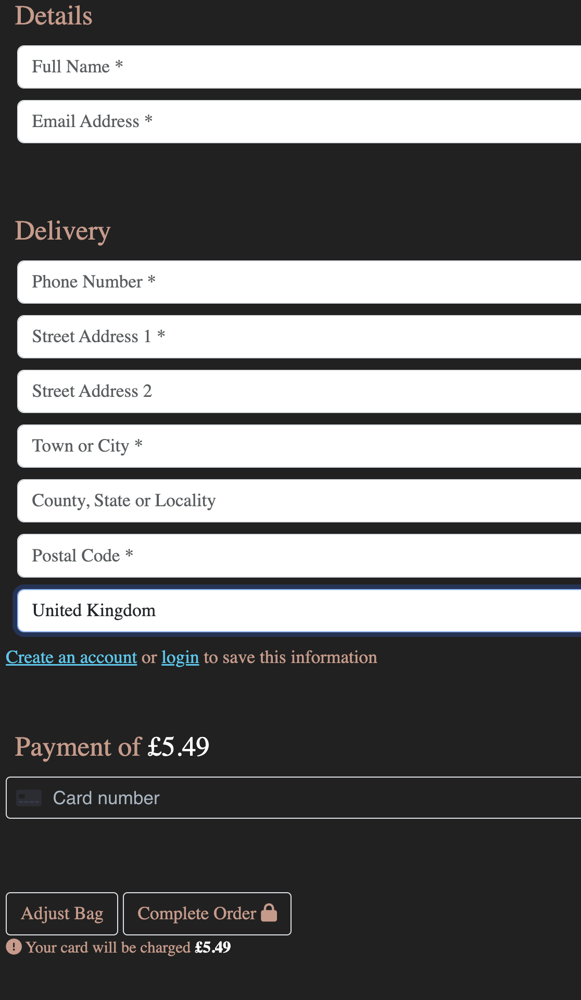
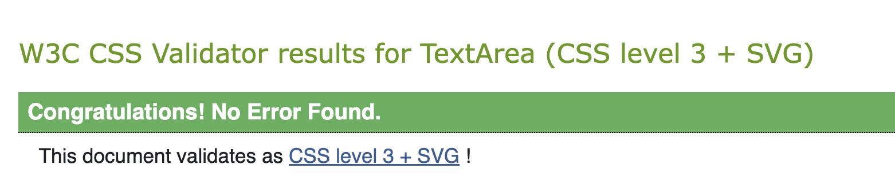

# **Roxy's Cakes** 

I built this website for my wife's little business what she used to have. Roxy's Cakes is a very easy to use website with bag, payment, reviews, contact us and newsletter features. You can browse from different cakes and add them to the bag where you can process forward to the checkout page.

[You can try it here on the live website!](https://roxys-cakes-vm.herokuapp.com/)

## _**Contents**_

* [User Stories](#user-stories)

* [Features](#features)
    * [Bag](#bag)
    * [Payment system](#payment-system)
    * [Reviews](#reviews)
    * [Contact us](#contact-us)
    * [Newsletter](#newsletter)
    * [Future ideas](#future-ideas)

* [Design](#design)
    * [Colours](#colours)
    * [Font](#font)
    * [Images](#images)

* [Testing](#testing)
    * [W3C Validator](#w3c-validator)
    * [CSS Validator](#css-validator)
    * [Lighthouse](#lighthouse)
    * [SEO](#seo)
    * [Manual testing](#manual-testing)
    * [Solved bugs](#solved-bugs)

* [Technology Used](#technology-used)

* [Deployment](#deployment)

* [Credits](#credits)

## _**User Stories**_

* I uploaded my User Stories on to my workspace you can find the PDF file [here](./media/readme/user_story/Roxy's%20Cakes%20User%20Stories%20-%20Sheet1.pdf)
 
* You can find the agile method to my user stories on my github repo just click [here](https://github.com/users/ViktorMathe/projects/5/views/1)

## _**Features**_

 ### _Bag:_
 
 * You can access to the bag by click on the icon which will contains all the items what you have put it in there. You can change the quantity with the provided form and it will update the price the subtotal and calculate it how much more do you need to spend for get a free delivery. From the bag you can proceed to the checkout page.

 

 ### _Payment System:_

 * On the checkout page you have to provide all the details what they ask for, if you are logged in and already used the shop once or created a profile the website fill out the form with some information so you do not have to fill out the same things again. You can see how much is the total what you have to pay. **PLEASE DO NOT PROVIDE REAL BANK CARD DETAILS!!**  If you wish to try out the payment system used the Stripe own testing card:
    * Card Number : 4242424242424242	
    * CVV: Any 3 digits	
    * Expiry Date: Any future date

     When the payment is complete the user get an email with the order details to the provided email address.

     
     

 ### _Reviews:_

 * Any user can leave a review about the shop and if they wish, image can be uploaded as well. The reviews can be edited or deleted by the person who wrote them or can be done by a superuser.

 ### _Contact us:_
 
 *  The user can fill out the form to contact the webshop. They have to provide an email address and if they would like can write the phone number as well. The form can be answered by a superuser and send an email to the receipent.

 ### _Newsletter:_

 * Anybody can subscribe for a newsletter on the home page with their email address then they got a confirmation email. The superuser can write a newsletter for all of the subscribers and send out real emails with a unique link which is provide the option to unsubscribe.
 
 ### _Future ideas:_
 
 * I would like to implement login via social platforms. 
 * Make searching option for different categories.

## _**Design**_

  * ### _Colours:_
    * The main colour theme is dark. The navigation bar and the footer are pure black with rose gold icons on it and light silver text.

  * ### _Font:_
    * I used a Lato google font for the whole website as it is nice and decorative for the theme.
 
  * ### _Images:_
    * All the images about the cakes are made by my wife, Roxana Mathe. The background and the logo is created by her as well.

## _**Testing**_

* ### _W3C Validator:_
    * I got back the following message : Document checking completed. No errors or warnings to show. from the official [W3C Website](https://validator.w3.org/nu/?doc=https%3A%2F%2Froxys-cakes-vm.herokuapp.com%2F)

    

* ### _CSS Validator:_
    * I got back the following message: Sorry! We found the following errors (17) URI : https://cdn.jsdelivr.net/npm/bootstrap@5.2.2/dist/css/bootstrap.min.css from the Jigsaw Validator which is bootstrap fault. My own CSS has no Error!
    

* ### _Lighthouse:_
    * I done the lighthouse check through an incognito because that is when I got back the true result which were the following:

    

* ### _Manual testing:_

    #### **Register New Account**

    * Expected: As a User I want to able to register to the website to book my cleaning 
    * Test: Create new account with username, create new account with already existing username, create new account with and without email address.  
    * Outcome: If the new account has a username the account is created, if an email address is entered or not. When trying to create a new account with an existing username, the user is encouraged to choose a different username since it already exists. When the account is registered the user is logged in and is notified by an alert. 

    #### Login

    * Expected: As a registered site user you should be able to log in to your accout to be able to interact with the site.
    * Test: Check Login functionality as registered user. 
    * Outcome: When entering valid login details the user is logged in and redirected to the home page and an alert notifies the user that they are logged in. 

    #### Logout

    * Expected: As a registered and logged in user you should be able to log out of the site. 
    * Test: Check Logout functionality as logged in user. 
    * Result: When clicking Logout the user is redirected to Logout page and asked to confirm that they are want to log out. When Log Out button is clicked the user is logged out and redirected to home page and an alert notifies the user that they are logged out.  

    #### **Testing as a User**

    ##### Add a Review

    * Expected : The user can write a review and can upload a picture if wish, and can view it on the review page.
    * Test: Write a review as a user and upload a picture.
    * Outcome: When the review has been wrote I get the notification and it appeared on the review page with or without picture.

    ##### Edit a Review

    * Expected : The user can edit a review and can upload or delete picture if wish, and get a notification when it is done.
    * Test: Edit a review as a user and deleted a picture.
    * Outcome: When the review has been edited I get the notification and it appeared on the review page without picture.

    ##### Delete a Review

    * Expected : The user can delete a review.
    * Test: Delete a review as a user.
    * Outcome: When the review has been deleted I get the notification and it disappeard from the review page.
    
    #### **Testing as a SuperUser**

    ##### Edit Review

    * Expected: The superuser can edit all the reviews do not matter who wrote it.
    * Test: Edit a review.
    * Outcome: The review has been edited and still on the review page.

    ##### Delete Review
    
    * Expected: The superuser is able to delete any review made by anyone.
    * Test: Delete review.
    * Outcome: The review has been deleted from the database and the frontend.

 * ### _Solved bugs_:

    * Bug:
    Solution: 

    * Bug: 
    Solution: 

## _**Technology Used**_
* [Django](https://www.djangoproject.com/ "Django Project website")
    - Django was used to build the models, forms and views of the app, and was the backbone of this project.
* [Bootstrap](https://getbootstrap.com/docs/5.2/getting-started/introduction/ "Bootstrap")
     - Bootstrap was used to implement the responsiveness of the site, using bootstrap classes, but also other styling such as buttons etc.
* [AWS](https://cloudinary.com/ "AWS")
     - Amazon Web Sevices was used as free cloud storage for images uploaded to the site through the cake,review and contact us forms.
* [Stripe](https://stripe.com/en-gb "Stripe website")
     - Stripe features was used to allow to use card payments online.
* [Crispy Forms](https://django-crispy-forms.readthedocs.io/en/latest/ "Crispy Forms documentation")
    - Crispy Forms was used to style the add and edit recipe forms, allowing more than one field to occupy a line on the form.
* [Google Fonts](https://fonts.google.com/ "Google Fonts")
    - Google fonts were used to import the fonts "Lato" into the style.css file. These fonts were used throughout the project.
* [Font Awesome](https://fontawesome.com/ "FontAwesome")
     - Font Awesome was used on all pages throughout the website to import icons (e.g. social media icons) for UX purposes.
* [GitPod](https://git-scm.com/ "GitPod")
     - Git was used for version control by utilizing the GitPod terminal to commit to Git and push to GitHub.
* [GitHub](https://github.com/ "Link to GitHub")
     - GitHub was used to store the project after pushing
* [ElephantSQL](https://www.elephantsql.com/ "ElephantSQL Database")
    - ElephantSQL was used to the new database instead of the Heroku's Postgres
* [Google Maps API](https://developers.google.com/maps/documentation/javascript/marker-clustering/ "Google Maps API")
 -  Google Maps API was used to make the map visible on the site with the marker on it.

## _**Deployment**_

* Create the Heroku App:
    - Select "Create new app" in Heroku.
    - Choose a name for your app and select the location.

* Connect GitHub repo:
    - On the deploy tab you choose the deployment method GitHub
    - You type your GitHub repo name to connect with Heroku
    - Click Connect

* Attach the ElephantSQL database (instead of Postgre on Heroku):  
    - Login to the ElephantSQL website
    - Create New Instance
    - Have to give a name to the plan and had to choose the Tiny Turtle plan which is free
    - Select the region, and data center near your location
    - Click Review and Create Instance
    - Return to the dashboard and click on the instance name and copy the ElephantSQL database URL
    - On the Heroku website go to the settings, reveal config vars
    - Add a new config var called DATABASE_URL and paste your ElephantSQL database url and click Add
    - The database has been added

* Prepare the environment and settings.py file:
    - In the Settings tab, click on Reveal Config Vars and copy the url next to DATABASE_URL.
    - In your GitPod workspace, create an env.py file in the main directory. 
    - Add the DATABASE_URL value and your chosen SECRET_KEY value to the env.py file.
    - Add the SECRET_KEY value to the Config Vars in Heroku.
    - Update the settings.py file to import the env file and add the SECRETKEY and DATABASE_URL file paths.
    - Update the Config Vars with the AWS url, adding into the settings.py file also.
    - In settings.py add the following sections:
        - Had to the add the followings to the INSTALLED_APPS list:
            - allauth ( for the register/login)
            - crispy forms
            - storages (for the AWS storage)
        - MESSAGE_TAGS ( to get the pop up messages if some action happened)
        - AWS, DATABASE
            - AWS_S3_OBJECT_PARAMETERS (for AWS cache control)
            - AWS_STORAGE_BUCKET_NAME (for to use the AWS)
            - AWS_S3_REGION_NAME
            - AWS_ACCESS_KEY_ID
            - AWS_SECRET_ACCESS_KEY
            - AWS_S3_CUSTOM_DOMAIN
            - STATICFILE_STORAGE
            - STATICFILES_LOCATION
            - DEFAULT_FILE_STORAGE
            - MEDIAFILES_LOCATION
            - MEDIA_URL
            - STATIC_URL
        - STRIPE
            - STRIPE_PUBLIC_KEY
            - STRIPE_SECRET_KEY
            - STRIPE_WH_SECRET
            - STRIPE_CURRENCY
            - DELIVERY_PERCENTAGE
            - FREE_DELIVERY
        - TEMPLATES_DIR
        - Update DIRS in TEMPLATES with TEMPLATES_DIR
        - Update ALLOWED_HOSTS with ['app_name.heroku.com', 'localhost']

* Deployment:
    - On the Heroku website you navigate to the deploy tab
    - You look for the Manual Deploy and choose the "main" branch
    - Click Deploy Branch

* Live website : [Roxy's Cakes]()

* ## _**Credits**_

    * The background I found it on the 

    * I would like to give credit to my mentor, the tutors helped me a lot during this project. I am really aprreciate it.

    * The logo was made by my wife, Roxana Mathe done it with Adobe Photoshop.
